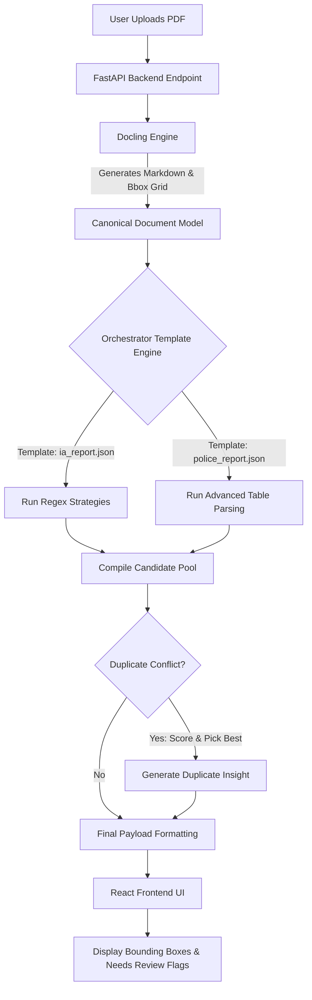

# ClaimsIntel VPC: Document Extraction Suite

ClaimsIntel VPC is a deterministic, template-driven Document Intelligence platform designed to securely extract, validate, and visualize structured data from complex documents like Police Reports and Independent Adjuster (IA) property reports.

By heavily leveraging Machine Learning Document Layout Analysis alongside a robust Orchestrator Template Engine, this solution delivers high-accuracy extraction for recognized fields with per-field confidence and human-in-the-loop fallback without relying on unpredictable LLMs.

---

## 🏗️ Solution Architecture & Tech Stack

The architecture is split into three main decoupled layers:

### 1. Frontend Interface (React & Vite)
* Drives the fast, interactive user interface.
* **PDF.js (`@react-pdf-viewer`)**: Renders the physical PDF document on screen and uses custom plugins to draw geometric bounding boxes over extracted text.
* Dynamically generates actionable UI insights based on extraction payloads.

### 2. Backend Orchestration Server (FastAPI)
* **Python (FastAPI)**: A high-performance async web framework that orchestrates the entire extraction pipeline, manages file routing, and serves the REST API.
* **SQLite (`feedback.db`)**: A lightweight local database used for storing Human-in-the-Loop custom fields and global learned patterns.

### 3. ML Layout Analysis & Template Engine
* **Docling (with EasyOCR fallback for scanned PDFs; not used on digital sample docs)**: The Machine Learning layer that converts visual PDFs into precise Markdown tables and tracks the physical `[x,y]` coordinates of every bounding block.
* **JSON Template Engine**: Acts as the strict Orchestrator. Evaluates `templates/police_report.json` and `templates/ia_report.json` using dynamic Python regex strategies (`GlobalRegexStrategy` and `AdvancedTableStrategy`) to pull nested arrays safely.

---

## 🔀 Data Flow Diagram

---

## 🌟 Key Features of the Solution

1. **Holistic Orchestrator Templates:** Uses flat JSON templates mapped to robust Python extractor strategies, producing normalized output formatting for arrays like `vehicles`, `parties`, and `witnesses`.
2. **Continuous Learning (Global Custom Fields):** Users can define Custom Fields on the fly via the database. The Orchestrator automatically learns these fields and attempts to extract them on all future documents universally.
3. **Automated Bounding Box Linking:** Traces extracted text strings back to their originating PDF pixels for precise visual confirmation.
4. **Insights Engine:** Automatically calculates "Next Best Actions" depending on what data was extracted (e.g. recommending Subrogation teams if third-party liability is detected).

---

## 🧠 How the Solution Learns (Human-in-the-Loop)

The solution learns without requiring expensive machine learning retraining! It utilizes a **Human-in-the-Loop (HITL) Pipeline** and a dynamic configuration engine.

### 1. Learning from Mistakes (The HITL Pipeline)
If the AI misses a field in a table (for example, it didn't find the "VIN" because the state trooper's form labeled the column as "Tag No." instead), here is how the system learns:
* **The Correction:** The claims adjuster notices the missing VIN in the UI, clicks the field, and types the correct value.
* **The Database:** The UI immediately sends this correction to the backend database (`feedback.db`).
* **Reverse Tracing (`train_feedback.py`):** A background learning script takes the adjuster's typed correction, re-opens the original raw document, and searches the document's tables for that exact value. Once it finds it, it traces straight up to the top of the column to see what the header was (e.g., "Tag No.").
* **Permanent Memory:** It permanently saves "Tag No." as an alias for "VIN" in the database (`table_aliases` table). The next time it processes a document with a "Tag No." column, it automatically extracts it!

### 2. Extracting Completely New Fields
If you need to start extracting a brand new field, there are two ways to do it without touching the Python code:
* **For Flat Fields (The JSON Templates):** Open the `police_report.json` or `ia_report.json` file in the backend and add a new block. Specify the `field_id` and give it a spatial label or regex pattern to look for. The Orchestrator dynamically reads this JSON file on every request, so it will immediately start extracting that new field on all future documents.
* **For Dynamic NLP Fields (The UI):** If an adjuster needs a specific field for a specific claim right now, they can scroll to the bottom of the UI and use the **"Add Custom Extraction Field"** input. They just type what they want (e.g., "Airbag Deployed"), click Add, and hit "Rerun Extraction". The backend will dynamically instruct the Orchestrator to hunt for that specific concept in the document and extract it.

---

## 🗂️ How Duplicates Are Managed

Because the Orchestrator runs an array of fallback strategies, it often locates multiple potential matches (Candidates) for the exact same field ID.

1. **Candidate Pool Gathering:** All matches are pushed into `all_candidates` with a base confidence score.
2. **Best Candidate Selection:** The Orchestrator ranks all candidates for a specific field and selects the one with the highest confidence score to be serialized into the final `record`.
3. **UI Transparency Insight:** The backend scans the candidate pool. If it notices that multiple valid candidates competed for the same field, it automatically injects a `duplicate_insight` array into the API payload. 
4. **Actionable Alerts:** The React frontend parses these insights and adds a visible red alert to the Document Insights card, instructing the human adjuster to specifically verify the machine's selection for that duplicate field.

---

## ⚠️ Exception & Audit Trail Management

### Exception Management
* **Missing Fields:** If a template expects a field but the strategy fails to find it, the Orchestrator does not crash. It injects `None` and safely logs it as a "Missing" reason.
* **Parser Failure:** If Docling fails to parse a badly corrupted PDF, the backend safely catches the exception and falls back to a mocked extraction text block, returning an Accuracy Score of `0%` so the frontend can safely handle the error state without a 500 server crash.
* **Needs Review Flags:** If confidence falls below thresholds or an extraction requires human confirmation, the backend flags the field in `review_flags`. The frontend binds this to a red validation badge directly on the editable input field.
* **Global Fault Tolerance:** All extraction endpoints are wrapped in global `try-except-finally` blocks, guaranteeing that temporary files are never leaked and unhandled exceptions always return a safe, formatted JSON error response instead of crashing the UI.

### Audit Trails (Interactive UI)
Every single candidate extraction decision is explicitly tracked inside the Orchestrator. 
* During generation, each Candidate records the `strategy_name` used (e.g. `global_regex`, `advanced_table`), the `pattern` that caught it, and the `page_number`.
* **Interactive UI:** Adjusters can click the "Search/Trace" icon next to any extracted field in the frontend. This opens a modal displaying the exact ranking of AI candidates, their confidence scores, the raw text pulled, and the specific extraction strategy used to arrive at that decision.
* These logs are preserved in the internal `audit` payload before final API serialization, ensuring full transparency and trust in the AI's rationale.

---

## 📂 Sample Documents Included

For testing and demonstration purposes, this repository includes a `sample documents/` directory pre-loaded with over 40 diverse PDF reports.
* **Coverage:** Includes both Police Reports and Independent Adjuster (IA) Reports.
* **Complexity:** Documents range from cleanly formatted digital forms (Low Complexity) to highly unstructured, multi-page weather event reports (High Complexity).
* **Usage:** Simply upload any of these files into the UI to immediately see the template extraction engine in action!

---

## ✅ What the Solution CAN Do

* **Extract Nested Arrays Robustly:** It can dynamically rip multi-row tabular data (Vehicles, Operators, Witnesses) out of unstructured PDFs and reconstruct them perfectly into JSON objects.
* **High extraction coverage for known layouts via multi-line fallback patterns and state-specific overlays:** Multi-pattern fallback strategies and 51 state-form overlays maximize field hit rates across diverse document formats.
* **Visual Verification:** It can prove exactly where it got data from by highlighting it directly over the raw PDF.

## ❌ What the Solution CANNOT Do

* **Extract Abstract Relationships from Dense Narratives:** If a report writes out a pure narrative paragraph (e.g., *"Driver 1 hit Driver 2 who then spun into Driver 3"*), the template engine cannot parse liability logic. It relies on standard structured grids.
* **Read Heavy Cursive:** The PyTorch OCR models are heavily optimized for printed grid text. Bad photocopies of highly cursive handwritten police notes will likely yield garbled text, which will immediately trigger the system's "Needs Review" exception handling.
