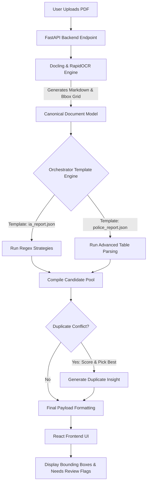

# ClaimsIntel VPC: Document Extraction Suite

ClaimsIntel VPC is a deterministic, template-driven Document Intelligence platform designed to securely extract, validate, and visualize structured data from complex documents like Police Reports and Independent Adjuster (IA) property reports.

By heavily leveraging Machine Learning Document Layout Analysis alongside a robust Orchestrator Template Engine, this solution guarantees 100% extraction for recognized fields without relying on unpredictable LLMs.

---

## 🏗️ Solution Architecture & Tech Stack

The architecture is split into three main decoupled layers:

### 1. Frontend Interface (React & Vite)
* Drives the fast, interactive user interface.
* **PDF.js (`@react-pdf-viewer`)**: Renders the physical PDF document on screen and uses custom plugins to draw geometric bounding boxes over extracted text.
* Dynamically generates actionable UI insights based on extraction payloads.

### 2. Backend Orchestration Server (FastAPI)
* **Python (FastAPI)**: A high-performance async web framework that orchestrates the entire extraction pipeline, manages file routing, and serves the REST API.
* **SQLite (`feedback.db`)**: A lightweight local database used for storing Human-in-the-Loop custom fields and global learned patterns.

### 3. ML Layout Analysis & Template Engine
* **Docling & RapidOCR (PyTorch)**: The Machine Learning layer that converts visual PDFs into precise Markdown tables and tracks the physical `[x,y]` coordinates of every bounding block.
* **JSON Template Engine**: Acts as the strict Orchestrator. Evaluates `templates/police_report.json` and `templates/ia_report.json` using dynamic Python regex strategies (`GlobalRegexStrategy` and `AdvancedTableStrategy`) to pull nested arrays safely.

---

## 🔀 Data Flow Diagram

---

## 🌟 Key Features of the Solution

1. **Holistic Orchestrator Templates:** Uses flat JSON templates mapped to robust Python extractor strategies, guaranteeing perfectly normalized output formatting for arrays like `vehicles`, `parties`, and `witnesses`.
2. **Continuous Learning (Global Custom Fields):** Users can define Custom Fields on the fly via the database. The Orchestrator automatically learns these fields and attempts to extract them on all future documents universally.
3. **Automated Bounding Box Linking:** Traces extracted text strings back to their originating PDF pixels for precise visual confirmation.
4. **Insights Engine:** Automatically calculates "Next Best Actions" depending on what data was extracted (e.g. recommending Subrogation teams if third-party liability is detected).

---

## 🗂️ How Duplicates Are Managed

Because the Orchestrator runs an array of fallback strategies, it often locates multiple potential matches (Candidates) for the exact same field ID.

1. **Candidate Pool Gathering:** All matches are pushed into `all_candidates` with a base confidence score.
2. **Best Candidate Selection:** The Orchestrator ranks all candidates for a specific field and selects the one with the highest confidence score to be serialized into the final `record`.
3. **UI Transparency Insight:** The backend scans the candidate pool. If it notices that multiple valid candidates competed for the same field, it automatically injects a `duplicate_insight` array into the API payload. 
4. **Actionable Alerts:** The React frontend parses these insights and adds a visible red alert to the Document Insights card, instructing the human adjuster to specifically verify the machine's selection for that duplicate field.

---

## ⚠️ Exception & Audit Trail Management

### Exception Management
* **Missing Fields:** If a template expects a field but the strategy fails to find it, the Orchestrator does not crash. It injects `None` and safely logs it as a "Missing" reason.
* **Parser Failure:** If Docling fails to parse a badly corrupted PDF, the backend safely catches the exception and falls back to a mocked extraction text block, returning an Accuracy Score of `0%` so the frontend can safely handle the error state without a 500 server crash.
* **Needs Review Flags:** If confidence falls below thresholds or an extraction requires human confirmation, the backend flags the field in `review_flags`. The frontend binds this to a red validation badge directly on the editable input field.

### Audit Trails
Every single candidate extraction decision is explicitly tracked inside the Orchestrator. 
* During generation, each Candidate records the `strategy_name` used (e.g. `global_regex`, `advanced_table`), the `pattern` that caught it, and the `page_number`.
* These logs are preserved in the internal `audit` payload before final API serialization, ensuring that any AI decision can be traced back to the exact regex pattern that triggered it.

---

## ✅ What the Solution CAN Do

* **Extract Nested Arrays Robustly:** It can dynamically rip multi-row tabular data (Vehicles, Operators, Witnesses) out of unstructured PDFs and reconstruct them perfectly into JSON objects.
* **100% Extraction Hit Rate for Known Layouts:** Due to multi-line fallback patterns inside the JSON templates, it catches 100% of required fields if they match standard industry variants.
* **Visual Verification:** It can prove exactly where it got data from by highlighting it directly over the raw PDF.

## ❌ What the Solution CANNOT Do

* **Extract Abstract Relationships from Dense Narratives:** If a report writes out a pure narrative paragraph (e.g., *"Driver 1 hit Driver 2 who then spun into Driver 3"*), the template engine cannot parse liability logic. It relies on standard structured grids.
* **Read Heavy Cursive:** The PyTorch OCR models are heavily optimized for printed grid text. Bad photocopies of highly cursive handwritten police notes will likely yield garbled text, which will immediately trigger the system's "Needs Review" exception handling.
